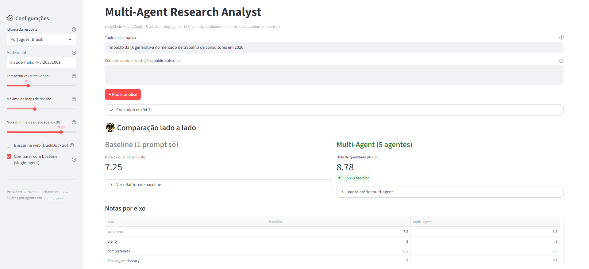
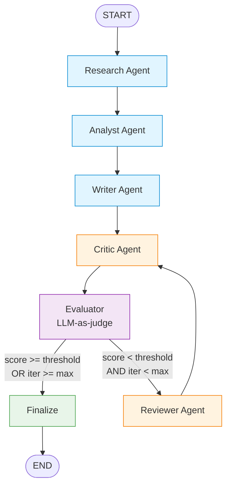
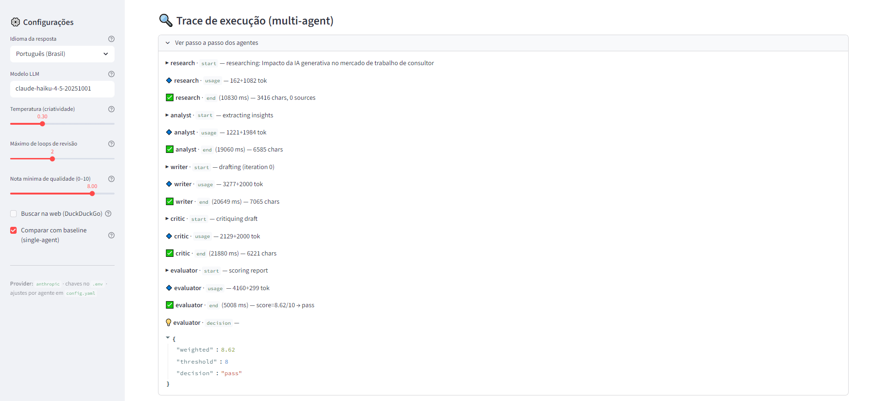
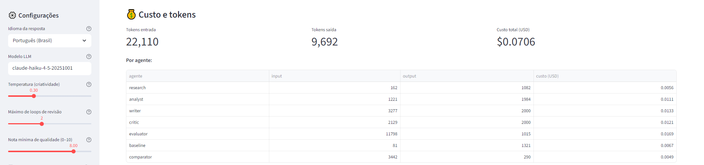
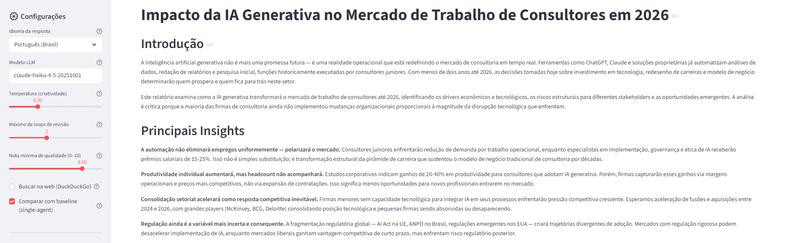

# Multi-Agent AI Research Analyst

A production-style demonstration of how to orchestrate multiple specialized LLM agents to produce higher-quality research reports than a single-prompt baseline. Built on **LangChain** + **LangGraph**, with built-in evaluation, observability, cost tracking, and a side-by-side comparison UI.

This is not a toy chatbot. It is a small AI product prototype that shows the patterns used in real GenAI engineering: stateful graphs, conditional loops, LLM-as-judge evaluation, and architectural separation between agents, orchestration, evaluation, and presentation.

> **🚀 Live demo:** _(deploy URL goes here)_
>
> Deployable to Streamlit Community Cloud or any platform supporting Procfiles (Railway, Render, Heroku). See [`Procfile`](Procfile).



---

## Why this exists

Most LLM demos are a single prompt with a thin UI. Real-world AI products are **systems**: they decompose a task across specialized roles, evaluate their own output, and iterate when quality is insufficient. This project demonstrates that pattern end-to-end on a topic any recruiter can understand — automated research reports — and includes a built-in A/B test that proves the multi-agent approach is measurably better than a single LLM call on the same input.

---

## Architecture

### Agents

| Agent       | Role                                                                       |
| ----------- | -------------------------------------------------------------------------- |
| Research    | Gathers raw notes (simulated knowledge or real web search via DuckDuckGo). |
| Analyst     | Distills notes into structured insights, drivers, risks, opportunities.    |
| Writer      | Produces a polished report draft with a fixed structure.                   |
| Critic      | Adversarially reviews the draft, flagging weak arguments and gaps.        |
| Reviewer    | Rewrites the draft to address every critique point.                        |
| Evaluator   | Independent LLM-as-judge that scores the draft on 4 axes.                 |

A separate `BaselineAgent` represents the naive single-prompt approach used for comparison.

### Workflow (LangGraph)



- **Stateful execution** via `ResearchState` (TypedDict) merged across nodes.
- **Conditional routing** decides whether to loop or finish, gated by a quality threshold AND an iteration counter (no infinite loops).
- **Modular nodes** — every agent is a class; the graph is just wiring. Swap an agent without touching the orchestration.

### Why multi-agent beats a single prompt

- **Specialization:** each agent has one job, one prompt, one temperature. The Critic can be cold and adversarial (T=0.1) while the Writer is creative (T=0.5). A single prompt has to compromise.
- **Adversarial loop:** the Critic actively looks for flaws. The Reviewer rewrites against those flaws. A single prompt cannot self-criticize meaningfully because it commits to one persona.
- **Quality gate:** the Evaluator decides "is this good enough?" using objective criteria. If not, the system iterates — automatically. A single call has no second chance.
- **Observability:** every step emits a structured log event. You can debug *why* a report turned out the way it did. With a single prompt, the only artifact is the final text.

### Why LangGraph

LangChain alone gives you LCEL chains — perfect for linear pipelines. But research workflows are inherently non-linear: critique can demand a rewrite, evaluation can demand more research, etc. LangGraph adds:

- **First-class state** that flows across nodes with proper merging semantics.
- **Conditional edges** for routing (`pass` vs `revise`).
- **Built-in cycle support** with `recursion_limit` as a safety net on top of our domain-level iteration counter.
- **Compile-time validation** of the graph topology.

---

## Project structure

```
multi-agent-research-analyst/
├── agents/                  # 5 LangGraph agents + baseline
│   ├── base.py              # BaseAgent: shared LLM + retry + logging
│   ├── research_agent.py
│   ├── analyst_agent.py
│   ├── writer_agent.py
│   ├── critic_agent.py
│   ├── reviewer_agent.py
│   └── baseline_agent.py    # single-prompt comparator
├── graph/
│   ├── state.py             # ResearchState TypedDict + initial_state()
│   └── workflow.py          # StateGraph assembly + conditional routing
├── evaluation/
│   ├── evaluator.py         # LLM-as-judge with JSON schema + tolerant parser
│   ├── comparator.py        # baseline vs multi-agent side-by-side
│   └── metrics.py           # cheap heuristics (length, structure, lexical diversity)
├── utils/
│   ├── config.py            # Pydantic-typed config loader
│   ├── llm.py               # Provider-agnostic LLM factory
│   ├── logger.py            # Structured StepLogger (in-memory + JSONL)
│   ├── pricing.py           # Per-model token pricing + run cost aggregator
│   ├── pdf.py               # Markdown → PDF rendering for report download
│   └── prompts.py           # All ChatPromptTemplates in one place
├── ui/
│   └── app.py               # Streamlit UI with side-by-side comparison
├── tests/
│   ├── test_smoke.py        # Wiring tests (no API key needed) + gated e2e
│   └── sample_queries.txt
├── docs/                    # Screenshots and example report for the README
├── main.py                  # CLI entrypoint
├── config.yaml              # Editable hyperparams (model, threshold, iters)
├── requirements.txt
├── .env.example
└── README.md
```

---

## Setup

```bash
# 1. Clone and enter
cd multi-agent-research-analyst

# 2. Create venv (Python 3.10+)
python -m venv .venv
.venv\Scripts\activate          # Windows
# source .venv/bin/activate     # macOS/Linux

# 3. Install
pip install -r requirements.txt

# 4. Configure provider keys
cp .env.example .env
# edit .env and add your OPENAI_API_KEY (or set PROVIDER=anthropic + ANTHROPIC_API_KEY)
```

## Usage

### CLI

```bash
# Run with default config (multi-agent + baseline comparison)
python main.py "Impact of AI in banking fraud detection"

# Skip the baseline comparison
python main.py "Carbon capture economics" --no-compare

# Tweak loop budget and quality threshold on the fly
python main.py "EU AI Act effects on startups" --max-iter 3 --threshold 8.5

# Export report
python main.py "..." --output report.md
```

### Streamlit UI

```bash
streamlit run ui/app.py
```

The UI shows:
- **Side-by-side comparison**: baseline report vs multi-agent report with quality scores and a delta.
- **Per-axis scoreboard**: coherence, clarity, completeness, factual consistency.
- **Judge verdict**: short LLM-written explanation of which is stronger and why.
- **Execution trace**: every agent step with timing and decisions.
- **Cost panel**: tokens and USD cost per agent.
- **Final report**: downloadable as Markdown or PDF.

#### Execution trace
Every agent emits structured events. The UI renders them as a step-by-step trace, including the routing decision after evaluation.



#### Cost & token panel
Per-agent token usage and USD cost are visible in real time, computed from each model's `usage_metadata`.



#### Final report
The multi-agent report is rendered in Markdown with download buttons (MD + PDF).



> 📄 **[See a full example report generated by the system](docs/example-report.md)** — query: *"Impacto da IA generativa no mercado de trabalho de consultores em 2026"*.

### Tests

```bash
pytest tests/ -v
```

Wiring tests run without an API key. The `test_e2e_short_run` test is auto-skipped unless `OPENAI_API_KEY` (or `ANTHROPIC_API_KEY`) is set.

---

## Configuration

Everything is in `config.yaml`. Highlights:

```yaml
llm:
  provider: anthropic                # or "openai"
  model: claude-haiku-4-5-20251001   # cheap + fast; swap for sonnet/opus for higher quality
  temperature: 0.3

agents:
  critic:
    temperature: 0.1   # adversarial → cold
  writer:
    temperature: 0.5   # creative

workflow:
  max_iterations: 2          # reviewer rewrite passes before giving up
  quality_threshold: 8.0     # below this triggers another loop
  enable_web_search: false   # flip to true for live DuckDuckGo retrieval

evaluation:
  weights:
    coherence: 0.30
    clarity: 0.25
    completeness: 0.30
    factual_consistency: 0.15
```

---

## Example output (abbreviated)

Query: *"Impact of AI in banking fraud detection"*

```
================ FINAL REPORT (multi-agent) ================
# Impact of AI in Banking Fraud Detection
## Introduction
Banks face an arms race against increasingly automated fraud rings...
## Key Insights
- Real-time graph-based models now flag synthetic identity rings ...
## Analysis
The shift from rules engines to ML lowered false-positive rates by ~40% ...
## Conclusion
Banks should prioritize feature stores and feedback loops over ...

================ EVALUATION ================
{
  "scores": {"coherence": 9.0, "clarity": 8.5, "completeness": 8.5, "factual_consistency": 8.0},
  "weighted_score": 8.55,
  "iterations": 1
}

================ BASELINE vs MULTI-AGENT ================
{ "baseline":   {"weighted_score": 6.85, ...},
  "multiagent": {"weighted_score": 8.55, ...},
  "delta":       1.70 }

Judge verdict:
Report B (multi-agent) is stronger. It contains explicit second-order effects
(model staleness, feedback loop poisoning) the baseline omits, and its
recommendations are operational rather than generic ...
```

---

## Observability

Every agent emits structured `LogEvent` records to:
- An in-memory list (consumed by the UI for the execution trace panel).
- `logs/*.jsonl` (one file per pipeline) for post-mortem analysis.

Optional: set `LANGCHAIN_TRACING_V2=true` and a `LANGCHAIN_API_KEY` in `.env` to also trace to LangSmith.

## Cost tracking

Token usage is captured from every LLM call (provider-agnostic via `usage_metadata`) and aggregated per agent. The UI shows a cost panel; the CLI prints a JSON summary.

Typical run on `claude-haiku-4-5` (multi-agent + baseline + comparator + 0 review loops):
- ~13k tokens total
- ~$0.05 USD per run

Pricing table lives in [`utils/pricing.py`](utils/pricing.py) and is easy to extend for new models.

---

## Future improvements

- **Streaming UI**: switch from blocking invokes to LangGraph's `astream` so the UI updates token-by-token.
- **Persistent memory**: add a SQLite checkpointer so workflows can resume after a crash and accumulate cross-run knowledge.
- **Multi-model comparison**: run the same query through Haiku, Sonnet, and Opus to surface cost-vs-quality trade-offs.
- **Panel of judges**: have 2–3 LLMs score independently and report inter-judge agreement for more robust evaluation.
- **Benchmark harness**: curate a corpus of `(query, gold_report)` pairs and report aggregate score distributions for baseline vs multi-agent.
- **Tool-using agents**: give the Research agent calculator/Python tools so it can verify numerical claims before passing them downstream.
- **RAG extension**: replace `ResearchAgent._gather_context` with a retriever over Chroma/FAISS for user-uploaded documents.

---

## Stack

- **Python 3.10+**
- **LangChain** — LLM abstraction, prompt templates
- **LangGraph** — stateful orchestration
- **Streamlit** — UI
- **Pydantic** — typed config
- **pytest** — tests
- Optional: **DuckDuckGo Search**, **LangSmith**, **Chroma/FAISS**
